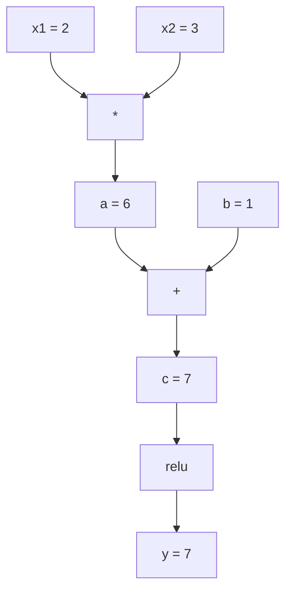

# 链式法则与自动微分

> 链式法则是每一个能够学习的神经网络背后的发动机。

**课程类型：** 实现 / 应用  
**所属模块：** 微积分与自动微分  
**前置知识：** Phase 1 Lesson 04：导数、偏导数、梯度与梯度下降  
**预计时间：** 约 90 分钟  
**使用语言：** Python / PyTorch  

---

## 1. 提出问题：为什么 AI 算法工程师必须理解链式法则与自动微分

上一课你已经知道如何给简单函数求导，也知道梯度可以告诉参数往哪个方向更新。  
但是神经网络不是一个简单函数，而是很多函数的复合：

```txt
输入 -> 矩阵乘法 -> 加偏置 -> 激活函数 -> 矩阵乘法 -> softmax -> loss
```

如果模型有几百万甚至几百亿个参数，我们不可能手动对每一个参数求导。  
数值导数也太慢，因为它需要反复扰动每个参数并重新前向计算。

真正可行的方法是：

```txt
链式法则提供数学规则。
自动微分提供计算算法。
反向传播把二者系统地应用到神经网络计算图上。
```

这就是 PyTorch、TensorFlow、JAX 能自动计算梯度的原因。

---

### 1.1 数学概念历史出现缘由

链式法则和自动微分都来自一个更大的问题：**复杂计算如何求导？**

| 数学 / 工程概念 | 历史出现缘由 |
|---|---|
| 链式法则 | 为了处理复合函数的求导问题 |
| 计算图 | 为了把复杂计算拆成一系列简单操作 |
| 前向模式自动微分 | 为了从输入出发，沿计算过程传播导数 |
| 反向模式自动微分 | 为了从输出出发，高效计算大量输入变量的梯度 |
| Dual Number | 为了让数值本身携带导数信息，自动传播一阶导数 |
| 拓扑排序 | 为了保证计算图中每个节点都在依赖项之后被处理 |
| 梯度累积 | 为了处理一个变量被多个后续操作共同使用的情况 |
| Autograd 引擎 | 为了自动记录操作并机械地应用链式法则 |
| 反向传播 | 为了高效训练多层神经网络 |
| 梯度检查 | 为了验证自动微分实现是否正确 |

可以这样理解：

```txt
现实问题：如何给复合函数求导？
数学抽象：链式法则

现实问题：如何描述一串复杂计算？
工程抽象：计算图

现实问题：如何让导数自动跟着计算流动？
算法抽象：自动微分

现实问题：神经网络有很多参数但只有一个 loss，如何一次算出所有梯度？
算法抽象：反向模式自动微分

现实问题：如何确认自动算出的梯度没错？
工程方法：梯度检查
```

---

### 1.2 原始问题是什么

本课要解决的原始问题是：

```txt
如何给一串复合函数自动求导？
如何把复杂计算拆成计算图？
如何让每个操作都知道自己的局部导数？
如何从输出 loss 反向传播梯度到每个参数？
为什么神经网络更适合反向模式而不是前向模式？
如何从零实现一个最小 autograd 引擎？
```

换成 AI 语言，就是：

```txt
PyTorch 的 requires_grad=True 到底做了什么？
loss.backward() 到底如何计算每个参数的梯度？
为什么梯度要累加，而不是直接覆盖？
为什么反向传播需要拓扑排序？
为什么神经网络训练本质上是 reverse-mode autodiff？
如何不用 PyTorch，只靠 Python 实现一个小型 MLP 并训练 XOR？
```

---

### 1.3 AI 中的现代问题

| 数学 / 工程知识点 | AI 中的现代问题 |
|---|---|
| 链式法则 | 多层神经网络如何逐层传递梯度 |
| 计算图 | forward pass 中每一步计算如何被记录 |
| 前向模式 | 少输入、多输出问题中的导数传播 |
| 反向模式 | 神经网络中一次 backward 得到所有参数梯度 |
| Value 包装 | 每个数字如何携带 value 和 grad |
| 局部导数 | 每个操作如何知道自己对输入的影响 |
| 拓扑排序 | backward 为什么必须按依赖顺序反向执行 |
| 梯度累积 | 参数被多处使用时，梯度贡献如何相加 |
| MLP | 多层神经网络如何由 neuron / layer 组合起来 |
| 梯度检查 | 如何验证 autograd 实现正确 |
| PyTorch autograd | 真实框架如何自动计算梯度 |

---

### 1.4 本课要解决的核心问题

学完本课，你应该能够回答：

1. 链式法则为什么是反向传播的数学基础？
2. 计算图如何表示一次前向计算？
3. 为什么梯度要从输出 loss 反向流向输入和参数？
4. 前向模式和反向模式自动微分有什么区别？
5. 为什么神经网络训练主要使用反向模式？
6. Dual Number 如何实现前向模式自动微分？
7. 一个最小 autograd 引擎需要哪些组件？
8. `Value` 类为什么要保存 `data`、`grad`、`_prev` 和 `_backward`？
9. 为什么 backward pass 需要拓扑排序？
10. 为什么梯度要用 `+=` 累积？
11. 如何用手写 autograd 引擎训练一个 MLP？
12. 如何用数值导数做 gradient checking？
13. 手写引擎和 PyTorch autograd 的关系是什么？

---

## 2. 概念定位：这节课学什么

---

### 2.1 所属模块

```txt
所属模块：微积分与自动微分
前置知识：导数、偏导数、梯度、梯度下降、基础 Python 类
后续连接：反向传播、神经网络训练、MLP、PyTorch autograd、优化器、深度学习框架实现
```

上一课解决的是“导数和梯度是什么”。  
本课进一步解决：**如何把导数和梯度自动应用到任意复杂的神经网络计算中。**

---

### 2.2 本课学习目标

完成本课后，你应该能够：

- 解释链式法则如何处理复合函数求导
- 画出简单函数的计算图
- 区分前向模式自动微分和反向模式自动微分
- 理解为什么神经网络适合 reverse-mode autodiff
- 实现一个最小 `Value` 类
- 为加法、乘法、幂、ReLU、tanh、exp、log 等操作实现 backward
- 使用拓扑排序完成一次反向传播
- 理解梯度累积的必要性
- 用手写 autograd 引擎构建并训练一个 MLP
- 用数值导数做 gradient checking
- 对照 PyTorch 验证手写引擎的正确性

---

### 2.3 本课在整体路线中的位置

```txt
导数与梯度
    ↓
链式法则
    ↓
计算图
    ↓
自动微分
    ↓
反向传播
    ↓
MLP 训练
    ↓
PyTorch / JAX / TensorFlow 深度学习框架
```

本课的核心能力是：

```txt
看到 loss.backward() 时，不只是知道它在“求梯度”，而是知道它如何沿计算图反向应用链式法则。
```

---

## 3. 理解概念：直觉、公式、计算图、AI 连接

---

### 3.1 链式法则：复合函数如何求导

**一句话直觉：**  
链式法则告诉我们，复合函数的总导数等于每一层局部导数的连乘。

如果：

```text
y = f(g(x))
```

那么：

```text
dy/dx = dy/dg * dg/dx = f'(g(x)) * g'(x)
```

例子：

```text
y = sin(x^2)
```

拆成：

```txt
g(x) = x^2
f(g) = sin(g)
```

局部导数：

```txt
g'(x) = 2x
f'(g) = cos(g)
```

所以：

```text
dy/dx = cos(x^2) * 2x
```

更深的复合函数：

```text
y = f(g(h(x)))
```

导数是：

```text
dy/dx = f'(g(h(x))) * g'(h(x)) * h'(x)
```

**AI 连接：**

神经网络就是多层复合函数：

```txt
input -> linear -> activation -> linear -> activation -> loss
```

每一层都贡献一个局部导数。  
反向传播就是从 loss 开始，把这些局部导数一层层乘回去。

---

### 3.2 计算图：把复杂计算拆成节点和边

**一句话直觉：**  
计算图把一次复杂计算拆成很多简单操作，方便记录前向值和反向梯度。

前向计算示例：

```text
x1 = 2
x2 = 3
a = x1 * x2
b = 1
c = a + b
y = relu(c)
```

对应计算图：



反向传播时，梯度从 `y` 开始反向流动：

```txt
dy/dy = 1
dy/dc = relu'(c)
dy/da = dy/dc * dc/da
dy/dx1 = dy/da * da/dx1
dy/dx2 = dy/da * da/dx2
```

**AI 连接：**

| 计算图元素 | 神经网络对应 |
|---|---|
| 节点 | tensor、operation、loss |
| 边 | 数据流或梯度流 |
| forward pass | 计算预测值和 loss |
| backward pass | 计算所有参数梯度 |
| 局部导数 | 每个操作自己的 backward rule |

---

### 3.3 前向模式自动微分

**一句话直觉：**  
前向模式从输入出发，把导数随着计算一起向前传播。

例如：

```text
y = sin(x^2)
```

从 `x = 2` 开始：

```txt
x = 2          dx/dx = 1
a = x^2        da/dx = 2x = 4
y = sin(a)     dy/dx = cos(a) * da/dx = cos(4) * 4
```

前向模式适合：

```txt
输入变量少，输出变量多
```

**AI 连接：**

| 场景 | 是否适合前向模式 |
|---|---|
| 少量输入变量求导 | 适合 |
| 参数极少的科学计算 | 适合 |
| 神经网络百万参数训练 | 不适合 |
| Jacobian-vector product | 常用 |

---

### 3.4 反向模式自动微分

**一句话直觉：**  
反向模式从输出开始，把梯度沿计算图反向传回所有输入。

仍然以：

```text
y = sin(x^2)
```

为例：

```txt
dy/dy = 1
dy/da = cos(a)
dy/dx = dy/da * da/dx
```

反向模式适合：

```txt
输入变量很多，输出变量很少
```

神经网络训练正是这种情况：

```txt
输入变量：百万级参数
输出变量：一个 loss
```

所以一次 backward 就能计算所有参数的梯度。

| 模式 | 起点 | 方向 | 适合场景 |
|---|---|---|---|
| 前向模式 | 输入 | 输入到输出 | 输入少、输出多 |
| 反向模式 | 输出 | 输出到输入 | 输入多、输出少 |
| 神经网络训练 | loss | loss 到参数 | 反向模式最合适 |

---

### 3.5 Dual Number：前向模式的一种实现方式

**一句话直觉：**  
Dual Number 让每个数字同时携带“值”和“导数”，计算时导数会自动跟着传播。

Dual Number 形式：

```text
a + b * epsilon
```

其中：

```text
epsilon^2 = 0
```

可以理解为：

```txt
(value, derivative)
```

例如：

```txt
(2, 1)
```

表示：

```txt
值是 2
对 x 的导数是 1
```

运算规则：

```text
(a, a') + (b, b') = (a + b, a' + b')
(a, a') * (b, b') = (a*b, a'*b + a*b')
sin(a, a') = (sin(a), cos(a)*a')
```

**AI 连接：**

Dual Number 主要帮助理解前向模式自动微分。  
真实深度学习训练更常用反向模式，但前向模式在一些高级自动微分任务中仍然有用。

---

### 3.6 自动微分引擎需要什么

**一句话直觉：**  
自动微分引擎就是一个会记录计算、保存局部导数、并能反向传播梯度的系统。

一个最小 autograd engine 需要三件事：

| 组件 | 作用 |
|---|---|
| Value 包装 | 每个数字保存 value 和 grad |
| 图记录 | 每个操作记录自己的输入节点 |
| backward 函数 | 每个操作知道如何把梯度传给父节点 |
| 拓扑排序 | 保证反向传播按依赖顺序执行 |
| 梯度累积 | 多路径贡献相加 |

对照 PyTorch：

| 手写引擎 | PyTorch |
|---|---|
| `Value.data` | `Tensor.data` / tensor value |
| `Value.grad` | `Tensor.grad` |
| `_prev` | 计算图父节点 |
| `_backward` | `grad_fn` |
| `backward()` | `tensor.backward()` |
| 动态图 | define-by-run |

---

### 3.7 拓扑排序：保证反向传播顺序正确

**一句话直觉：**  
拓扑排序让每个节点都排在它依赖的节点之后，这样反向传播时就可以从输出一路正确走回输入。

为什么需要拓扑排序？

```txt
一个节点的梯度可能来自多个后续节点。
只有等所有后续贡献都准备好，才能把完整梯度继续传给它的输入。
```

反向传播顺序：

```txt
先前向构图
再拓扑排序
然后从输出节点反向遍历
每个节点调用自己的 _backward()
```

**AI 连接：**

神经网络计算图可能很复杂。  
拓扑排序保证了：

```txt
loss 的梯度先到最后一层，再到中间层，最后到输入和参数。
```

---

### 3.8 梯度累积：为什么是 += 而不是 =

**一句话直觉：**  
如果一个变量被多个操作使用，那么它对最终 loss 的影响来自多条路径，梯度需要相加。

例如：

```text
y = x*x + x
```

这里 `x` 同时出现在两条路径中：

```txt
路径 1：x*x
路径 2：+x
```

所以：

```text
dy/dx = 2x + 1
```

如果 backward 时用：

```python
x.grad = ...
```

就可能覆盖掉其中一条路径的贡献。

所以应该用：

```python
x.grad += ...
```

**AI 连接：**

在神经网络中，一个参数可能通过多个路径影响 loss。  
梯度累积是计算正确梯度的必要条件。

---

### 3.9 PyTorch autograd 的工作方式

**一句话直觉：**  
PyTorch 会在前向计算时动态记录计算图，在 `backward()` 时沿图反向应用链式法则。

例子：

```python
x = torch.tensor(2.0, requires_grad=True)
y = x ** 2 + 3 * x + 1
y.backward()
print(x.grad)
```

数学上：

```text
y = x^2 + 3x + 1
dy/dx = 2x + 3
```

在 `x = 2` 时：

```text
dy/dx = 7
```

PyTorch 内部做了这些事：

```txt
1. x 是一个 requires_grad=True 的 Tensor
2. 每个操作都会生成新节点，并记录 backward 函数
3. y.backward() 从 y 开始反向传播
4. 每个 grad_fn 计算局部梯度
5. 梯度累积到 x.grad
```

PyTorch 是动态图系统：

```txt
每次 forward pass 都会重新构建一张新图。
```

所以它支持 Python 中的 if/else 和 loop。

---

### 3.10 本课核心概念总表

| 概念 | 一句话直觉 | AI 中的对应位置 |
|---|---|---|
| 链式法则 | 复合函数导数等于局部导数连乘 | backpropagation |
| 计算图 | 把计算拆成节点和边 | PyTorch dynamic graph |
| 前向模式 | 导数从输入向输出传播 | 少输入、多输出 |
| 反向模式 | 梯度从输出向输入传播 | 神经网络训练 |
| Dual Number | 数字携带值和导数 | forward-mode autodiff |
| Value | 包装数值和梯度 | mini autograd tensor |
| `_backward` | 每个操作的局部反传规则 | grad_fn |
| 拓扑排序 | 按依赖关系排序节点 | correct backward order |
| 梯度累积 | 多路径梯度相加 | shared parameters |
| MLP | 多层感知机 | 基础神经网络 |
| 梯度检查 | 用数值导数验证梯度 | debug autograd |
| 动态图 | 每次运行都构建图 | PyTorch define-by-run |

---

## 4. 手写实现：从零实现 autograd 引擎和 MLP

这一节不用 PyTorch。  
目标是亲手实现一个最小自动微分系统，理解 `loss.backward()` 的底层机制。

---

### 4.1 实现 Value 类

```python
class Value:
    def __init__(self, data, children=(), op=''):
        self.data = data
        self.grad = 0.0
        self._backward = lambda: None
        self._prev = set(children)
        self._op = op

    def __repr__(self):
        return f"Value(data={self.data:.4f}, grad={self.grad:.4f})"
```

每个 `Value` 保存：

| 属性 | 作用 |
|---|---|
| `data` | 当前节点的数值 |
| `grad` | 最终输出对当前节点的梯度 |
| `_backward` | 当前操作的反向传播函数 |
| `_prev` | 生成当前节点的父节点 |
| `_op` | 当前节点由哪个操作生成 |

---

### 4.2 为加法、乘法和 ReLU 实现梯度追踪

```python
def __add__(self, other):
    other = other if isinstance(other, Value) else Value(other)
    out = Value(self.data + other.data, (self, other), '+')

    def _backward():
        self.grad += out.grad
        other.grad += out.grad

    out._backward = _backward
    return out


def __mul__(self, other):
    other = other if isinstance(other, Value) else Value(other)
    out = Value(self.data * other.data, (self, other), '*')

    def _backward():
        self.grad += other.data * out.grad
        other.grad += self.data * out.grad

    out._backward = _backward
    return out


def relu(self):
    out = Value(max(0, self.data), (self,), 'relu')

    def _backward():
        self.grad += (1.0 if out.data > 0 else 0.0) * out.grad

    out._backward = _backward
    return out
```

说明：

| 操作 | 局部导数 |
|---|---|
| `z = x + y` | `dz/dx = 1`，`dz/dy = 1` |
| `z = x * y` | `dz/dx = y`，`dz/dy = x` |
| `z = relu(x)` | `x > 0` 时导数为 1，否则为 0 |

注意这里使用：

```python
+=
```

而不是：

```python
=
```

因为同一个变量可能通过多条路径影响最终输出。

---

### 4.3 实现 backward：拓扑排序 + 反向遍历

```python
def backward(self):
    topo = []
    visited = set()

    def build_topo(v):
        if v not in visited:
            visited.add(v)

            for child in v._prev:
                build_topo(child)

            topo.append(v)

    build_topo(self)

    self.grad = 1.0

    for v in reversed(topo):
        v._backward()
```

解释：

```txt
1. 先从输出节点开始做拓扑排序
2. 得到一个依赖顺序
3. 把输出节点的梯度设为 1，也就是 dy/dy = 1
4. 反向遍历所有节点，调用每个节点的 _backward()
```

---

### 4.4 补齐更多运算

为了训练神经网络，我们还需要减法、幂、除法、指数、对数、tanh 等操作。

```python
def __neg__(self):
    return self * -1


def __sub__(self, other):
    return self + (-other)


def __radd__(self, other):
    return self + other


def __rmul__(self, other):
    return self * other


def __rsub__(self, other):
    return other + (-self)


def __pow__(self, n):
    out = Value(self.data ** n, (self,), f'**{n}')

    def _backward():
        self.grad += n * (self.data ** (n - 1)) * out.grad

    out._backward = _backward
    return out


def __truediv__(self, other):
    other = other if isinstance(other, Value) else Value(other)
    return self * (other ** -1)


def exp(self):
    import math

    e = math.exp(self.data)
    out = Value(e, (self,), 'exp')

    def _backward():
        self.grad += e * out.grad

    out._backward = _backward
    return out


def log(self):
    import math

    out = Value(math.log(self.data), (self,), 'log')

    def _backward():
        self.grad += (1.0 / self.data) * out.grad

    out._backward = _backward
    return out


def tanh(self):
    import math

    t = math.tanh(self.data)
    out = Value(t, (self,), 'tanh')

    def _backward():
        self.grad += (1 - t ** 2) * out.grad

    out._backward = _backward
    return out
```

| 操作 | backward rule | 用途 |
|---|---|---|
| `__sub__` | 复用加法和取负 | loss 中的 `pred - target` |
| `__pow__` | `n*x^(n-1)` | MSE、平方误差 |
| `__truediv__` | 复用乘法和 `pow(-1)` | 归一化 |
| `exp` | `exp(x)` | softmax、log-likelihood |
| `log` | `1/x` | cross-entropy、log probability |
| `tanh` | `1 - tanh(x)^2` | 经典激活函数 |

---

### 4.5 构建一个最小 MLP

有了完整的 `Value` 类，就可以搭建神经网络。  
不使用 PyTorch，不使用 NumPy，只使用 Python 和链式法则。

```python
import random


class Neuron:
    def __init__(self, n_inputs):
        self.w = [Value(random.uniform(-1, 1)) for _ in range(n_inputs)]
        self.b = Value(0.0)

    def __call__(self, x):
        act = sum((wi * xi for wi, xi in zip(self.w, x)), self.b)
        return act.tanh()

    def parameters(self):
        return self.w + [self.b]


class Layer:
    def __init__(self, n_inputs, n_outputs):
        self.neurons = [Neuron(n_inputs) for _ in range(n_outputs)]

    def __call__(self, x):
        return [n(x) for n in self.neurons]

    def parameters(self):
        return [p for n in self.neurons for p in n.parameters()]


class MLP:
    def __init__(self, sizes):
        self.layers = [
            Layer(sizes[i], sizes[i + 1])
            for i in range(len(sizes) - 1)
        ]

    def __call__(self, x):
        for layer in self.layers:
            x = layer(x)

        return x[0] if len(x) == 1 else x

    def parameters(self):
        return [p for layer in self.layers for p in layer.parameters()]
```

结构解释：

| 类 | 含义 |
|---|---|
| `Neuron` | 一个神经元：加权求和 + bias + activation |
| `Layer` | 多个神经元组成一层 |
| `MLP` | 多层神经网络 |
| `parameters()` | 返回所有可训练参数 |

---

### 4.6 用手写 autograd 训练 XOR

XOR 数据：

```txt
[0, 0] -> -1
[0, 1] ->  1
[1, 0] ->  1
[1, 1] -> -1
```

训练代码：

```python
random.seed(42)

model = MLP([2, 4, 1])

xs = [
    [0, 0],
    [0, 1],
    [1, 0],
    [1, 1],
]

ys = [-1, 1, 1, -1]

for step in range(100):
    preds = [model(x) for x in xs]
    loss = sum((p - y) ** 2 for p, y in zip(preds, ys))

    for p in model.parameters():
        p.grad = 0.0

    loss.backward()

    lr = 0.05

    for p in model.parameters():
        p.data -= lr * p.grad

    if step % 20 == 0:
        print(f"step {step:3d}  loss = {loss.data:.4f}")

print("Predictions after training:")

for x, y in zip(xs, ys):
    print(f"input={x}  target={y:2d}  pred={model(x).data:6.3f}")
```

这就是一个完整训练循环：

```txt
forward -> loss -> zero_grad -> backward -> parameter update
```

---

### 4.7 梯度检查：用数值导数验证 autograd

```python
def gradient_check(build_expr, x_val, h=1e-7):
    x = Value(x_val)
    y = build_expr(x)
    y.backward()

    autodiff_grad = x.grad

    y_plus = build_expr(Value(x_val + h)).data
    y_minus = build_expr(Value(x_val - h)).data
    numerical_grad = (y_plus - y_minus) / (2 * h)

    diff = abs(autodiff_grad - numerical_grad)

    return autodiff_grad, numerical_grad, diff
```

测试一个复杂表达式：

```python
def expr(x):
    return (x ** 3 + x * 2 + 1).tanh()


ad, num, diff = gradient_check(expr, 0.5)

print(f"Autodiff:  {ad:.8f}")
print(f"Numerical: {num:.8f}")
print(f"Difference: {diff:.2e}")
```

如果差异很小，例如：

```txt
diff < 1e-5
```

说明你的 backward 实现基本正确。

---

### 4.8 手动验证一个简单计算图

```python
x1 = Value(2.0)
x2 = Value(3.0)

a = x1 * x2
b = a + Value(1.0)
y = b.relu()

y.backward()

print(f"y = {y.data}")
print(f"dy/dx1 = {x1.grad}")
print(f"dy/dx2 = {x2.grad}")
```

手动计算：

```text
y = relu(x1*x2 + 1)
```

当：

```txt
x1 = 2
x2 = 3
```

有：

```txt
x1*x2 + 1 = 7 > 0
```

所以 ReLU 是恒等映射：

```text
dy/dx1 = x2 = 3
dy/dx2 = x1 = 2
```

如果手写引擎输出相同，就说明链式法则传播正确。

---

## 5. 生产使用：用 PyTorch 验证同样的自动微分

---

### 5.1 PyTorch 验证简单计算图

```python
import torch

x1 = torch.tensor(2.0, requires_grad=True)
x2 = torch.tensor(3.0, requires_grad=True)

a = x1 * x2
b = a + 1.0
y = torch.relu(b)

y.backward()

print(f"PyTorch dy/dx1 = {x1.grad.item()}")
print(f"PyTorch dy/dx2 = {x2.grad.item()}")
```

输出应该是：

```txt
dy/dx1 = 3
dy/dx2 = 2
```

这和手写 autograd 引擎一致。

---

### 5.2 PyTorch 验证复杂表达式

```python
import torch

a = torch.tensor(2.0, requires_grad=True)
b = torch.tensor(-3.0, requires_grad=True)
c = torch.tensor(10.0, requires_grad=True)

f = torch.relu(a * b + c)

f.backward()

print(f"df/da = {a.grad.item()}")
print(f"df/db = {b.grad.item()}")
print(f"df/dc = {c.grad.item()}")
```

数学上：

```text
f = relu(a*b + c)
```

当：

```txt
a = 2
b = -3
c = 10
```

有：

```text
a*b + c = 4 > 0
```

所以：

```text
df/da = b = -3
df/db = a = 2
df/dc = 1
```

---

### 5.3 手写 autograd vs PyTorch

| 对比项 | 手写 Value 引擎 | PyTorch autograd |
|---|---|---|
| 数值包装 | `Value(data)` | `torch.Tensor` |
| 梯度属性 | `.grad` | `.grad` |
| 是否记录图 | 手动在操作里记录 `_prev` | `requires_grad=True` 后自动记录 |
| 局部 backward | 自己写 `_backward` | 框架内置 `grad_fn` |
| 反向传播 | 自己实现 `backward()` | `tensor.backward()` |
| 图类型 | 动态图 | 动态图 |
| 性能 | 纯 Python，慢 | C++/CUDA 加速，快 |
| 用途 | 学习原理 | 真实训练和部署 |

---

## 6. 交付沉淀：产出物、连接关系、练习、术语表

---

### 6.1 本课产出

```txt
code/autodiff.py
code/use_pytorch.py
outputs/skill-autodiff.md
outputs/exercises-solutions.md
```

| 文件 | 作用 |
|---|---|
| `code/autodiff.py` | 从零实现 `Value`、自动微分、MLP 和 XOR 训练 |
| `code/use_pytorch.py` | PyTorch autograd 对照验证 |
| `outputs/skill-autodiff.md` | 构建和调试自动微分系统的 skill |
| `outputs/exercises-solutions.md` | 练习题与参考答案 |

---

### 6.2 知识连接关系

| 本课知识点 | 后续连接 |
|---|---|
| 链式法则 | 反向传播、自动微分 |
| 计算图 | PyTorch dynamic graph、JAX tracing |
| 前向模式 | JVP、Dual Number、科学计算 |
| 反向模式 | 神经网络训练、backpropagation |
| Value 类 | tensor / scalar autograd |
| 拓扑排序 | 正确执行 backward |
| 梯度累积 | 参数共享、多路径计算图 |
| MLP | 神经网络基础结构 |
| 梯度检查 | 自定义算子、debug autograd |
| PyTorch autograd | 深度学习框架 |

---

### 6.3 AI 应用连接

| 数学 / 工程知识点 | AI 应用 |
|---|---|
| 链式法则 | 反向传播 |
| 计算图 | 深度学习框架内部表示 |
| 反向模式自动微分 | 神经网络训练 |
| 梯度累积 | 参数共享、residual path、多分支网络 |
| tanh / ReLU | 激活函数 |
| MLP | 基础前馈神经网络 |
| XOR 训练 | 非线性分类问题 |
| gradient checking | 自定义 layer / loss 的验证 |
| dynamic graph | PyTorch 控制流和动态图模型 |

---

### 6.4 练习

1. **实现 `__pow__`。**  
   给 `Value` 类添加 `__pow__`，让它支持 `x ** n`。验证 `d/dx(x^3)` 在 `x = 2` 时等于 `12.0`。

2. **实现 `tanh`。**  
   给 `Value` 类添加 `tanh` 激活函数。验证：

   ```txt
   tanh'(0) ≈ 1
   tanh'(2) ≈ 0.0707
   ```

3. **构造单个神经元计算图。**  
   手写：

   ```text
   y = relu(w1*x1 + w2*x2 + b)
   ```

   计算 `w1`、`w2`、`x1`、`x2`、`b` 的梯度，并用 PyTorch 验证。

4. **实现前向模式自动微分。**  
   使用 Dual Number 实现一个 `Dual` 类，验证它和反向模式在简单函数上的导数一致。

5. **加入 sigmoid。**  
   给 `Value` 类添加 `sigmoid`，并验证它的导数：

   ```text
   sigmoid'(x) = sigmoid(x)(1 - sigmoid(x))
   ```

6. **扩展 MLP。**  
   把 `MLP([2, 4, 1])` 改成 `MLP([2, 4, 4, 1])`，观察训练 XOR 的 loss 是否还能下降。

---

### 6.5 关键术语

| 术语 | 常见说法 | 真正含义 |
|---|---|---|
| 链式法则 | 导数相乘 | 复合函数的导数等于每层局部导数按路径相乘 |
| 计算图 | 网络图 | 节点表示操作或值，边表示前向数据流和反向梯度流 |
| 前向模式 | 导数向前传 | 从输入出发传播导数，适合输入少输出多 |
| 反向模式 | 反向传播 | 从输出出发传播梯度，适合输入多输出少 |
| 自动微分 | 自动求梯度 | 记录操作并通过链式法则机械计算精确梯度 |
| Dual Number | 值加导数 | 一种让数值携带导数信息的前向模式实现 |
| Value | 小型 Tensor | 包装数值、梯度、父节点和 backward 函数 |
| 拓扑排序 | 依赖顺序 | 保证每个节点在所有依赖项处理后再传播梯度 |
| 梯度累积 | 加起来 | 多条路径对同一变量的梯度贡献需要相加 |
| 动态图 | 边运行边建图 | 每次 forward 重新构建计算图，支持 Python 控制流 |
| 梯度检查 | 数值验证 | 用有限差分和自动微分结果对比，检查 backward 是否正确 |
| MLP | 多层感知机 | 多层神经元堆叠形成的前馈神经网络 |
| Neuron | 神经元 | 加权求和加偏置，再通过激活函数 |

---

### 6.6 自检问题

学完本课后，你应该能回答：

- 链式法则最初解决什么数学问题？
- 为什么神经网络是复合函数？
- 计算图如何记录一次前向计算？
- 前向模式和反向模式自动微分有什么区别？
- 为什么神经网络更适合反向模式？
- Dual Number 如何携带导数信息？
- `Value` 类为什么要保存 `_prev` 和 `_backward`？
- 为什么 backward pass 需要拓扑排序？
- 为什么梯度要累积，而不是覆盖？
- 如何从零实现 `loss.backward()`？
- 如何用手写 autograd 引擎训练 XOR？
- gradient checking 如何验证 autograd 正确性？
- PyTorch autograd 和手写引擎的对应关系是什么？

---

## 附录：本课最小代码文件建议

如果要拆成代码文件，可以这样组织：

```txt
code/
├── autodiff.py
└── use_pytorch.py
```

### `autodiff.py`

包含：

```txt
Value
Value.__add__
Value.__mul__
Value.relu
Value.backward
Value.__pow__
Value.exp
Value.log
Value.tanh
Neuron
Layer
MLP
gradient_check
XOR training loop
```

### `use_pytorch.py`

包含：

```txt
torch.tensor
requires_grad=True
torch.relu
backward()
x.grad
manual comparison with Value engine
```
