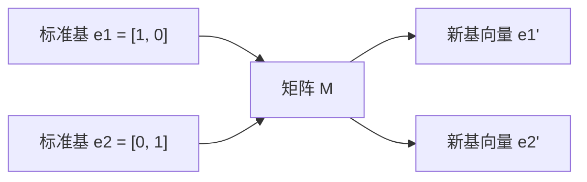

# 矩阵变换

> 矩阵不是一张数字表，而是一台重塑空间的机器。理解它如何改变每一个点，就理解了整个变换。

**课程类型：** 实现 / 应用  
**所属模块：** 线性代数  
**前置知识：** Phase 1 Lesson 01-02：线性代数直觉、向量与矩阵基本运算  
**预计时间：** 约 75 分钟  
**使用语言：** Python / NumPy / Julia  

---

## 1. 提出问题：为什么 AI 算法工程师必须理解矩阵变换

当你阅读 AI 论文或工程代码时，会经常看到这些说法：

```txt
PCA 要寻找协方差矩阵的特征向量。
RNN 稳定性和特征值大小有关。
数据增强会对图像应用随机旋转、缩放、剪切。
谱聚类会使用图拉普拉斯矩阵的特征向量。
```

如果你只把矩阵看成一张数字表，这些说法会很抽象。  
但如果你把矩阵理解成“空间变换”，它们就会变得直观：

```txt
旋转矩阵：让空间旋转
缩放矩阵：让空间拉伸或压缩
剪切矩阵：让空间倾斜
反射矩阵：让空间镜像翻转
特征向量：变换后方向不变的特殊方向
特征值：该方向被拉伸或压缩的倍数
```

---

### 1.1 数学概念历史出现缘由

矩阵变换最早不是为了 AI 出现的，而是为了统一描述几何、物理和线性方程中的“变化”。

| 数学概念 | 历史出现缘由 |
|---|---|
| 线性变换 | 为了描述直线、平面、空间中保持线性结构的变化 |
| 旋转矩阵 | 为了描述物体、坐标系、刚体在空间中的旋转 |
| 缩放矩阵 | 为了描述长度、面积、体积沿不同方向的伸缩 |
| 剪切矩阵 | 为了描述平行四边形变形、材料形变和坐标倾斜 |
| 反射矩阵 | 为了描述镜像、对称和方向翻转 |
| 变换复合 | 为了描述多个空间变换连续发生的结果 |
| 特征值 / 特征向量 | 为了寻找变换中方向不变的特殊方向 |
| 特征分解 | 为了把复杂矩阵拆成“换坐标 -> 缩放 -> 换回来”的过程 |
| 行列式 | 为了度量变换对面积或体积的缩放 |

可以这样理解：

```txt
现实问题：如何描述空间中所有点一起旋转？
数学抽象：旋转矩阵

现实问题：如何描述空间沿不同方向被拉伸？
数学抽象：缩放矩阵

现实问题：如何描述空间被倾斜但面积保持？
数学抽象：剪切矩阵

现实问题：如何判断一个变换有没有压扁空间？
数学抽象：行列式

现实问题：如何找到矩阵变换中方向不变的轴？
数学抽象：特征向量

现实问题：如何量化这些方向被拉伸多少？
数学抽象：特征值
```

---

### 1.2 原始问题是什么

本课要解决的原始问题是：

```txt
矩阵到底如何改变空间？
为什么同一个矩阵作用到所有点上，就能形成旋转、缩放、剪切或反射？
为什么多个矩阵相乘可以表示连续变换？
为什么矩阵乘法顺序会影响结果？
哪些方向在矩阵变换后不会改变方向？
一个矩阵如何通过特征值和特征向量暴露它的核心结构？
```

换成 AI 语言，就是：

```txt
PCA 为什么要找协方差矩阵的特征向量？
RNN 为什么会有梯度爆炸或梯度消失？
图神经网络和谱聚类为什么关心矩阵特征值？
数据增强中的旋转、缩放和剪切到底在变换什么？
矩阵行列式为什么能反映空间是否被压缩或翻转？
```

---

### 1.3 AI 中的现代问题

| 数学知识点 | AI 中的现代问题 |
|---|---|
| 旋转矩阵 | 图像增强、3D 几何、坐标变换 |
| 缩放矩阵 | 特征缩放、图像 resize、坐标变换 |
| 剪切矩阵 | 图像增强、仿射变换 |
| 反射矩阵 | 数据增强、对称性建模 |
| 变换复合 | 多层网络、多个线性变换连续作用 |
| 矩阵乘法顺序 | 多个操作组合时顺序不可交换 |
| 特征向量 | PCA 主方向、图结构方向、稳定模式 |
| 特征值 | 方差大小、系统稳定性、梯度爆炸/消失 |
| 特征分解 | 降维、谱方法、矩阵分析 |
| 行列式 | 空间体积缩放、可逆性、normalizing flows |

---

### 1.4 本课要解决的核心问题

学完本课，你应该能够回答：

1. 为什么矩阵可以表示空间变换？
2. 旋转、缩放、剪切、反射分别如何写成矩阵？
3. 为什么连续应用多个变换等价于矩阵相乘？
4. 为什么矩阵乘法顺序会影响结果？
5. 什么是特征向量和特征值？
6. 如何从特征方程计算 2x2 矩阵的特征值？
7. 特征值为什么影响 PCA、RNN 稳定性和谱聚类？
8. 行列式为什么可以表示面积或体积缩放？
9. 如何从零实现这些矩阵变换？
10. NumPy 中对应的生产级 API 是什么？

---

## 2. 概念定位：这节课学什么

---

### 2.1 所属模块

```txt
所属模块：线性代数
前置知识：向量、矩阵、矩阵乘法、行列式基础
后续连接：PCA、SVD、RNN 稳定性、谱聚类、图神经网络、仿射变换、normalizing flows
```

本课是线性代数从“矩阵运算”进入“矩阵几何意义”的关键一课。  
上一课你已经会实现矩阵加法、矩阵乘法、转置、行列式和逆矩阵；本课要进一步理解：这些矩阵运算到底如何重塑空间。

---

### 2.2 本课学习目标

完成本课后，你应该能够：

- 构造 2D 旋转、缩放、剪切和反射矩阵
- 构造 3D 绕 x / y / z 轴旋转的矩阵
- 将矩阵变换应用到 2D / 3D 点上
- 用矩阵乘法组合多个变换
- 解释为什么变换顺序会影响最终结果
- 从特征方程计算 2x2 矩阵的特征值
- 计算 2x2 矩阵的特征向量
- 解释特征值和特征向量在 PCA、稳定性分析和谱方法中的作用
- 使用 NumPy 完成矩阵变换、特征分解和行列式计算

---

### 2.3 本课在整体路线中的位置

```txt
向量与矩阵基本运算
    ↓
矩阵变换：旋转、缩放、剪切、反射
    ↓
特征值与特征向量
    ↓
PCA / SVD / 谱聚类
    ↓
神经网络稳定性、图学习、表示空间分析
```

本课的核心能力是：

```txt
看到一个矩阵时，不只是看它的数字，而是能想象它如何改变整个空间。
```

---

## 3. 理解概念：直觉、公式、几何解释、AI 连接

---

### 3.1 矩阵就是空间变换

**一句话直觉：**  
矩阵告诉我们标准基向量被送到哪里，而整个空间的变化就由这些新基向量决定。

二维标准基：

```txt
e1 = [1, 0]
e2 = [0, 1]
```

一个 2x2 矩阵可以看作：

```txt
M = [ new_e1  new_e2 ]
```

也就是说，矩阵的列向量就是原来标准基向量变换后的新位置。



**AI 连接：**

| AI 场景 | 矩阵变换含义 |
|---|---|
| 线性层 | 把输入特征空间映射到输出特征空间 |
| embedding projection | 把 token 表示投影到 query/key/value 空间 |
| PCA | 把数据投影到主成分方向 |
| 图谱方法 | 用矩阵揭示图结构 |

---

### 3.2 旋转矩阵：保持距离和角度的变换

**一句话直觉：**  
旋转矩阵让所有点围绕原点旋转，但不改变距离和角度。

二维旋转矩阵：

```text
R(theta) = [[cos(theta), -sin(theta)],
            [sin(theta),  cos(theta)]]
```

如果 `theta = 45°`，点会沿圆弧旋转。

**性质：**

| 性质 | 含义 |
|---|---|
| 保持长度 | 向量模长不变 |
| 保持角度 | 两个向量夹角不变 |
| 行列式绝对值为 1 | 面积不变 |
| 行列式为 1 | 不翻转方向 |

**AI 连接：**

| 场景 | 旋转作用 |
|---|---|
| 图像增强 | 随机旋转图片，提升模型鲁棒性 |
| 3D 视觉 | 表示相机或物体姿态 |
| RoPE 位置编码直觉 | 用旋转描述位置信息变化 |
| 表征空间分析 | 判断表示是否经过旋转式变换 |

---

### 3.3 3D 旋转：绕某个轴旋转

**一句话直觉：**  
三维旋转需要指定旋转轴，绕哪个轴旋转，哪个轴的坐标保持不变。

绕 z 轴旋转：

```text
Rz(theta) = [[cos(theta), -sin(theta), 0],
             [sin(theta),  cos(theta), 0],
             [0,           0,          1]]
```

含义：

```txt
x-y 平面旋转，z 坐标保持不变。
```

绕 x 轴旋转：

```text
Rx(theta) = [[1, 0,           0],
             [0, cos(theta), -sin(theta)],
             [0, sin(theta),  cos(theta)]]
```

含义：

```txt
y-z 平面旋转，x 坐标保持不变。
```

绕 y 轴旋转：

```text
Ry(theta) = [[ cos(theta), 0, sin(theta)],
             [ 0,          1, 0],
             [-sin(theta), 0, cos(theta)]]
```

含义：

```txt
x-z 平面旋转，y 坐标保持不变。
```

**AI 连接：**

3D 旋转常见于：

- 机器人
- 自动驾驶
- 3D point cloud
- 相机姿态估计
- NeRF / 3D Gaussian Splatting
- 空间几何数据增强

---

### 3.4 缩放矩阵：沿坐标轴拉伸或压缩

**一句话直觉：**  
缩放矩阵沿不同坐标轴独立拉伸或压缩空间。

二维缩放矩阵：

```text
S = [[sx, 0],
     [0, sy]]
```

例如：

```txt
sx = 2
sy = 0.5
```

表示：

```txt
x 方向放大 2 倍
y 方向压缩到 0.5 倍
```

**AI 连接：**

| 场景 | 缩放作用 |
|---|---|
| 图像 resize | 改变图像尺寸 |
| 数据归一化 | 改变特征尺度 |
| 特征缩放 | 让不同特征处在可比较范围 |
| 对角矩阵变换 | 每个维度独立缩放 |
| SVD / PCA | 奇异值或特征值表示方向上的缩放强度 |

---

### 3.5 剪切矩阵：让空间倾斜

**一句话直觉：**  
剪切会让一个坐标依赖另一个坐标，从而把矩形变成平行四边形。

x 方向剪切：

```text
Shx = [[1, k],
       [0, 1]]
```

含义：

```txt
x_new = x + k*y
y_new = y
```

y 方向剪切：

```text
Shy = [[1, 0],
       [k, 1]]
```

含义：

```txt
x_new = x
y_new = y + k*x
```

**性质：**

| 性质 | 含义 |
|---|---|
| 一个方向保持不变 | 另一个方向发生倾斜 |
| 面积通常保持 | 典型剪切矩阵行列式为 1 |
| 角度改变 | 矩形会变成平行四边形 |

**AI 连接：**

剪切变换常用于：

- 图像数据增强
- OCR 文字倾斜校正
- 仿射变换
- 坐标空间变换

---

### 3.6 反射矩阵：镜像翻转空间

**一句话直觉：**  
反射矩阵把点关于某个轴或平面镜像翻转。

关于 y 轴反射：

```text
Reflect_y = [[-1, 0],
             [0,  1]]
```

点：

```txt
[2, 1] -> [-2, 1]
```

关于 x 轴反射：

```text
Reflect_x = [[1,  0],
             [0, -1]]
```

点：

```txt
[2, 1] -> [2, -1]
```

**AI 连接：**

| 场景 | 反射作用 |
|---|---|
| 图像增强 | 水平翻转、垂直翻转 |
| 对称性建模 | 利用数据中的镜像对称 |
| 计算机视觉 | 扩大训练样本多样性 |
| 几何变换 | 改变方向但保持大小 |

---

### 3.7 变换复合：连续变换等于矩阵相乘

**一句话直觉：**  
连续应用多个线性变换，等价于把它们的矩阵相乘。

如果先应用 `A`，再应用 `B`，那么结果是：

```text
result = B @ A @ point
```

注意顺序：

```txt
B @ A 表示先做 A，再做 B。
```

**矩阵乘法顺序很重要。**

例子：

```txt
先旋转 90°，再缩放
```

和：

```txt
先缩放，再旋转 90°
```

结果通常不同。

这是因为：

```text
S @ R != R @ S
```

**AI 连接：**

| 场景 | 复合变换含义 |
|---|---|
| 多层神经网络 | 多个矩阵和非线性连续作用 |
| 数据增强 pipeline | 旋转、缩放、裁剪、剪切组合 |
| attention projection | 多个投影矩阵组合 |
| 3D 视觉 | 坐标系之间连续变换 |

---

### 3.8 特征向量与特征值：方向不变的特殊轴

**一句话直觉：**  
特征向量是矩阵变换后方向不变的向量；特征值是它被拉伸或压缩的倍数。

核心公式：

```text
A @ v = lambda * v
```

解释：

| 符号 | 含义 |
|---|---|
| `A` | 矩阵 |
| `v` | 特征向量 |
| `lambda` | 特征值 |
| `A @ v` | 矩阵作用到向量上 |
| `lambda * v` | 方向不变，只改变长度 |

例子：

```txt
A = [[2, 1],
     [1, 2]]
```

对于：

```txt
v = [1, 1]
```

有：

```txt
A @ [1, 1] = [3, 3] = 3 * [1, 1]
```

所以：

```txt
[1, 1] 是特征向量
3 是特征值
```

对于：

```txt
v = [1, -1]
```

有：

```txt
A @ [1, -1] = [1, -1] = 1 * [1, -1]
```

所以：

```txt
[1, -1] 是特征向量
1 是特征值
```

**AI 连接：**

| 场景 | 特征值 / 特征向量作用 |
|---|---|
| PCA | 协方差矩阵的特征向量是主成分方向 |
| RNN 稳定性 | 特征值模长影响状态是否爆炸或消失 |
| 谱聚类 | 图拉普拉斯特征向量揭示聚类结构 |
| GNN | 图结构和矩阵谱性质有关 |
| 优化 | Hessian 特征值反映 loss surface 曲率 |

---

### 3.9 特征方程：如何求 2x2 矩阵特征值

**一句话直觉：**  
特征值来自“哪些缩放倍数会让矩阵失去可逆性”的问题。

特征方程：

```text
det(A - lambda * I) = 0
```

对于 2x2 矩阵：

```text
A = [[a, b],
     [c, d]]
```

特征值满足：

```text
lambda^2 - (a + d)lambda + (ad - bc) = 0
```

其中：

| 项 | 含义 |
|---|---|
| `a + d` | trace，矩阵对角线之和 |
| `ad - bc` | determinant，行列式 |
| `lambda` | 特征值 |

**AI 连接：**

这个公式是理解 PCA、稳定性分析、谱方法的基础。  
实际工程中我们通常不手算，而是调用：

```python
np.linalg.eig(A)
```

但手写一遍能帮助你理解它在计算什么。

---

### 3.10 特征分解：把矩阵拆成方向和强度

**一句话直觉：**  
特征分解把一个矩阵拆成“换到特征向量坐标系 -> 沿各方向缩放 -> 换回原坐标系”。

如果矩阵有足够多线性无关的特征向量，则可以写成：

```text
A = V @ D @ V^(-1)
```

解释：

| 符号 | 含义 |
|---|---|
| `V` | 特征向量组成的矩阵 |
| `D` | 特征值组成的对角矩阵 |
| `V^(-1)` | 把坐标变换回原空间 |
| `A` | 原始矩阵 |

可以理解为：

```txt
先旋转到特征向量坐标系
再沿每个特征方向缩放
最后旋转回原坐标系
```

**AI 连接：**

| 场景 | 作用 |
|---|---|
| PCA | 找主方向并排序 |
| 矩阵分析 | 拆解变换的基本模式 |
| 动态系统 | 分析长期行为 |
| 谱聚类 | 利用特征向量发现结构 |
| 表征分析 | 观察模型空间中的重要方向 |

---

### 3.11 行列式：面积或体积缩放因子

**一句话直觉：**  
行列式告诉我们一个矩阵把面积或体积放大、缩小、翻转或压扁了多少。

| 行列式 | 几何含义 |
|---|---|
| `det = 1` | 面积保持，例如旋转 |
| `det = 2` | 面积放大 2 倍 |
| `det = 0` | 空间被压扁到更低维，不可逆 |
| `det = -1` | 面积保持，但方向翻转，例如反射 |

常见变换的行列式：

```txt
|det(旋转矩阵)| = 1
det(缩放矩阵) = sx * sy
det(剪切矩阵) = 1
det(反射矩阵) = -1
```

**AI 连接：**

行列式常见于：

- normalizing flows
- 可逆神经网络
- 变量替换中的体积校正
- 判断矩阵是否丢失维度
- 理解特征是否被压扁

---

### 3.12 本课核心概念总表

| 数学概念 | 一句话直觉 | AI 中的对应位置 |
|---|---|---|
| 矩阵变换 | 矩阵重塑整个空间 | linear layer、projection |
| 旋转矩阵 | 保持距离和角度的旋转 | 图像增强、3D 视觉 |
| 缩放矩阵 | 沿坐标轴拉伸或压缩 | 特征缩放、PCA |
| 剪切矩阵 | 倾斜空间 | 仿射变换、图像增强 |
| 反射矩阵 | 镜像翻转空间 | 数据增强、对称性 |
| 变换复合 | 多个矩阵连续作用 | 多层网络、pipeline |
| 特征向量 | 方向不变的特殊向量 | PCA、谱聚类 |
| 特征值 | 特征方向上的缩放倍数 | 稳定性、方差解释 |
| 特征分解 | 拆解矩阵的方向和强度 | PCA、谱方法 |
| 行列式 | 面积/体积缩放因子 | 可逆性、flows |

---

## 4. 手写实现：从零实现矩阵变换和特征值

这一节先不用 NumPy。  
目标是让你从代码上理解矩阵如何重塑空间。

---

### 4.1 实现 2D 变换矩阵

```python
import math


def rotation_2d(theta):
    c, s = math.cos(theta), math.sin(theta)
    return [[c, -s], [s, c]]


def scaling_2d(sx, sy):
    return [[sx, 0], [0, sy]]


def shearing_2d(kx, ky):
    return [[1, kx], [ky, 1]]


def reflection_x():
    return [[1, 0], [0, -1]]


def reflection_y():
    return [[-1, 0], [0, 1]]
```

这些函数分别对应：

| 函数 | 数学变换 |
|---|---|
| `rotation_2d` | 旋转 |
| `scaling_2d` | 缩放 |
| `shearing_2d` | 剪切 |
| `reflection_x` | 关于 x 轴反射 |
| `reflection_y` | 关于 y 轴反射 |

---

### 4.2 实现矩阵乘向量和矩阵乘矩阵

```python
def mat_vec_mul(matrix, vector):
    return [
        sum(matrix[i][j] * vector[j] for j in range(len(vector)))
        for i in range(len(matrix))
    ]


def mat_mul(a, b):
    rows_a, cols_b = len(a), len(b[0])
    cols_a = len(a[0])

    return [
        [
            sum(a[i][k] * b[k][j] for k in range(cols_a))
            for j in range(cols_b)
        ]
        for i in range(rows_a)
    ]
```

---

### 4.3 验证基本变换

```python
point = [1.0, 0.0]
angle = math.pi / 4

rotated = mat_vec_mul(rotation_2d(angle), point)
print(f"Rotate (1,0) by 45 deg: ({rotated[0]:.4f}, {rotated[1]:.4f})")

scaled = mat_vec_mul(scaling_2d(2, 3), [1.0, 1.0])
print(f"Scale (1,1) by (2,3): ({scaled[0]:.1f}, {scaled[1]:.1f})")

sheared = mat_vec_mul(shearing_2d(1, 0), [1.0, 1.0])
print(f"Shear (1,1) kx=1: ({sheared[0]:.1f}, {sheared[1]:.1f})")

reflected = mat_vec_mul(reflection_y(), [2.0, 1.0])
print(f"Reflect (2,1) across y: ({reflected[0]:.1f}, {reflected[1]:.1f})")
```

---

### 4.4 验证变换复合和顺序问题

```python
R = rotation_2d(math.pi / 2)
S = scaling_2d(2, 0.5)

rotate_then_scale = mat_mul(S, R)
scale_then_rotate = mat_mul(R, S)

point = [1.0, 0.0]

result1 = mat_vec_mul(rotate_then_scale, point)
result2 = mat_vec_mul(scale_then_rotate, point)

print(f"Rotate 90 then scale: ({result1[0]:.2f}, {result1[1]:.2f})")
print(f"Scale then rotate 90: ({result2[0]:.2f}, {result2[1]:.2f})")
print(f"Same? {result1 == result2}")
```

解释：

```txt
rotate_then_scale = S @ R
scale_then_rotate = R @ S

结果不同，说明矩阵乘法顺序很重要。
```

---

### 4.5 从零计算 2x2 特征值

对于：

```text
A = [[a, b],
     [c, d]]
```

特征值满足：

```text
lambda^2 - (a+d)lambda + (ad-bc) = 0
```

实现：

```python
def eigenvalues_2x2(matrix):
    a, b = matrix[0]
    c, d = matrix[1]

    trace = a + d
    det = a * d - b * c
    discriminant = trace ** 2 - 4 * det

    if discriminant < 0:
        real = trace / 2
        imag = (-discriminant) ** 0.5 / 2
        return (complex(real, imag), complex(real, -imag))

    sqrt_disc = discriminant ** 0.5
    return ((trace + sqrt_disc) / 2, (trace - sqrt_disc) / 2)
```

---

### 4.6 从零计算 2x2 特征向量

```python
def eigenvector_2x2(matrix, eigenvalue):
    a, b = matrix[0]
    c, d = matrix[1]

    if abs(b) > 1e-10:
        v = [b, eigenvalue - a]
    elif abs(c) > 1e-10:
        v = [eigenvalue - d, c]
    else:
        if abs(a - eigenvalue) < 1e-10:
            v = [1, 0]
        else:
            v = [0, 1]

    mag = (v[0] ** 2 + v[1] ** 2) ** 0.5
    return [v[0] / mag, v[1] / mag]
```

验证：

```python
A = [[2, 1], [1, 2]]

vals = eigenvalues_2x2(A)

print(f"Matrix: {A}")
print(f"Eigenvalues: {vals[0]:.4f}, {vals[1]:.4f}")

for val in vals:
    vec = eigenvector_2x2(A, val)
    result = mat_vec_mul(A, vec)
    scaled = [val * vec[0], val * vec[1]]

    print(f"  lambda={val:.1f}, v={[round(x, 4) for x in vec]}")
    print(f"    A@v = {[round(x, 4) for x in result]}")
    print(f"    lambda*v = {[round(x, 4) for x in scaled]}")
```

如果 `A@v` 和 `lambda*v` 相同，就说明特征值和特征向量计算正确。

---

### 4.7 用行列式理解体积缩放

```python
def det_2x2(matrix):
    return matrix[0][0] * matrix[1][1] - matrix[0][1] * matrix[1][0]


print(f"det(rotation 45) = {det_2x2(rotation_2d(math.pi / 4)):.4f}")
print(f"det(scale 2,3)   = {det_2x2(scaling_2d(2, 3)):.1f}")
print(f"det(shear kx=1)  = {det_2x2(shearing_2d(1, 0)):.1f}")
print(f"det(reflect y)   = {det_2x2(reflection_y()):.1f}")

singular = [[1, 2], [2, 4]]
print(f"det(singular)    = {det_2x2(singular):.1f}")
print("Singular: columns are proportional, space collapses to a line.")
```

---

## 5. 生产使用：用 NumPy 完成同样任务

---

### 5.1 NumPy 实现 2D 旋转和缩放

```python
import numpy as np

theta = np.pi / 4

R = np.array([
    [np.cos(theta), -np.sin(theta)],
    [np.sin(theta),  np.cos(theta)]
])

point = np.array([1.0, 0.0])

print(f"Rotate (1,0) by 45 deg: {R @ point}")

S = np.diag([2.0, 3.0])
composed = S @ R

print(f"Scale(2,3) after Rotate(45): {composed @ point}")
```

---

### 5.2 NumPy 计算特征值和特征向量

```python
A = np.array([[2, 1], [1, 2]], dtype=float)

eigenvalues, eigenvectors = np.linalg.eig(A)

print(f"Eigenvalues: {eigenvalues}")
print(f"Eigenvectors (columns):\n{eigenvectors}")

for i in range(len(eigenvalues)):
    v = eigenvectors[:, i]
    lam = eigenvalues[i]

    print(f"A @ v{i} = {A @ v}")
    print(f"lambda * v{i} = {lam * v}")
```

注意：

```txt
NumPy 返回的 eigenvectors 中，每一列是一个特征向量。
```

---

### 5.3 NumPy 计算行列式

```python
print(f"det(R) = {np.linalg.det(R):.4f}")
print(f"det(S) = {np.linalg.det(S):.1f}")
```

---

### 5.4 NumPy 验证特征分解

```python
B = np.array([[3, 1], [0, 2]], dtype=float)

vals, vecs = np.linalg.eig(B)

D = np.diag(vals)
V = vecs

reconstructed = V @ D @ np.linalg.inv(V)

print("Original:")
print(B)

print("Reconstructed:")
print(reconstructed)
```

如果重构结果接近原矩阵，说明：

```text
B = V @ D @ V^-1
```

成立。

---

### 5.5 NumPy 实现 3D 旋转

```python
def rotation_3d_z(theta):
    c, s = np.cos(theta), np.sin(theta)

    return np.array([
        [c, -s, 0],
        [s,  c, 0],
        [0,  0, 1]
    ])


def rotation_3d_x(theta):
    c, s = np.cos(theta), np.sin(theta)

    return np.array([
        [1, 0,  0],
        [0, c, -s],
        [0, s,  c]
    ])


point_3d = np.array([1.0, 0.0, 0.0])

rotated_z = rotation_3d_z(np.pi / 2) @ point_3d
rotated_x = rotation_3d_x(np.pi / 2) @ point_3d

print(f"3D point: {point_3d}")
print(f"Rotate 90 around z: {np.round(rotated_z, 4)}")
print(f"Rotate 90 around x: {np.round(rotated_x, 4)}")
```

---

### 5.6 手写实现 vs 生产库

| 对比项 | 手写实现 | NumPy |
|---|---|---|
| 目的 | 理解矩阵变换原理 | 工程实践 |
| 性能 | 慢 | 快，底层使用优化线性代数库 |
| 特征值计算 | 只适合 2x2 教学 | 支持大矩阵 |
| 复数特征值 | 需要自己处理 | 自动处理 |
| 稳定性 | 简化实现，数值稳定性有限 | 更稳定 |
| 使用场景 | 学习、验证直觉 | 科学计算、工程实现 |

---

## 6. 交付沉淀：产出物、连接关系、练习、术语表

---

### 6.1 本课产出

```txt
code/from_scratch.py
code/use_numpy.py
outputs/prompt-matrix-transformations.md
outputs/exercises-solutions.md
```

| 文件 | 作用 |
|---|---|
| `code/from_scratch.py` | 从零实现旋转、缩放、剪切、反射、特征值、特征向量、行列式 |
| `code/use_numpy.py` | NumPy 版本矩阵变换、特征分解和 3D 旋转 |
| `outputs/prompt-matrix-transformations.md` | 用于教学矩阵变换直觉的 prompt |
| `outputs/exercises-solutions.md` | 练习题和参考答案 |

---

### 6.2 知识连接关系

| 本课知识点 | 后续连接 |
|---|---|
| 旋转矩阵 | 图像增强、3D 几何、RoPE |
| 缩放矩阵 | 特征缩放、PCA、SVD |
| 剪切矩阵 | 仿射变换、图像增强 |
| 反射矩阵 | 数据增强、对称性 |
| 变换复合 | 多层网络、坐标系变换 |
| 特征值 | PCA、RNN 稳定性、谱方法 |
| 特征向量 | 主成分、图结构、稳定方向 |
| 特征分解 | PCA、谱聚类、矩阵分析 |
| 行列式 | 可逆性、normalizing flows |

---

### 6.3 AI 应用连接

| 数学知识点 | AI 应用 |
|---|---|
| 旋转 / 缩放 / 剪切 / 反射 | 图像数据增强 |
| 矩阵复合 | 多层神经网络和变换 pipeline |
| 特征向量 | PCA 主方向 |
| 特征值 | 方差解释、RNN 稳定性 |
| 特征分解 | 谱聚类、矩阵分析 |
| 行列式 | normalizing flows 的体积变化 |
| 3D 旋转 | 机器人、自动驾驶、3D 视觉 |

---

### 6.4 练习

1. **变换单位正方形。**  
   对单位正方形的四个角点 `[0,0]`、`[1,0]`、`[1,1]`、`[0,1]` 分别应用旋转、缩放和剪切。打印变换前后的坐标，并验证旋转是否保持边长。

2. **手算特征值。**  
   使用特征方程计算矩阵：

   ```txt
   [[4, 2],
    [1, 3]]
   ```

   的特征值，然后用你手写的函数和 NumPy 验证。

3. **组合三个变换。**  
   构造三个变换：

   ```txt
   旋转 30°
   缩放 [1.5, 0.8]
   x 方向剪切 kx = 0.3
   ```

   将它们组合后应用到圆上的 8 个点。打印变换前后坐标。

4. **验证行列式乘法性质。**  
   计算组合矩阵的行列式，并验证它是否等于各个变换矩阵行列式的乘积。

5. **解释顺序差异。**  
   比较：

   ```txt
   S @ R @ point
   R @ S @ point
   ```

   说明为什么结果不同。

---

### 6.5 关键术语

| 术语 | 常见说法 | 真正含义 |
|---|---|---|
| 旋转矩阵 | 让东西转起来 | 保持距离和角度的正交变换，行列式为 1 |
| 缩放矩阵 | 让东西变大或变小 | 沿每个坐标轴独立拉伸或压缩 |
| 剪切矩阵 | 把东西斜过来 | 一个坐标按另一个坐标比例偏移，矩形变平行四边形 |
| 反射矩阵 | 镜像翻转 | 关于轴或平面翻转空间，行列式通常为 -1 |
| 变换复合 | 连续做多个操作 | 用矩阵乘法串联多个变换，顺序很重要 |
| 特征向量 | 特殊方向 | 矩阵作用后方向不变，只被缩放 |
| 特征值 | 拉伸倍数 | 特征向量方向上被缩放的比例 |
| 特征分解 | 拆矩阵 | 把矩阵拆成特征方向和对应缩放强度 |
| 特征方程 | 求特征值的方程 | `det(A - lambda I) = 0` |
| 行列式 | 一个矩阵对应的数 | 变换对面积或体积的缩放因子 |

---

### 6.6 自检问题

学完本课后，你应该能回答：

- 为什么矩阵可以被理解为空间变换？
- 旋转、缩放、剪切、反射分别如何用矩阵表示？
- 为什么旋转矩阵保持长度和角度？
- 为什么剪切会改变形状但可以保持面积？
- 为什么矩阵复合时顺序很重要？
- `B @ A @ point` 为什么表示先做 A，再做 B？
- 什么是特征向量和特征值？
- 为什么 PCA 关心协方差矩阵的特征向量？
- 为什么特征值模长影响系统稳定性？
- 行列式为什么能表示面积或体积缩放？
- 如何从零实现 2D 旋转、缩放、剪切、反射？
- 如何从零计算 2x2 矩阵的特征值和特征向量？
- NumPy 中对应的 API 是什么？

---

## 附录：本课最小代码文件建议

如果要拆成代码文件，可以这样组织：

```txt
code/
├── from_scratch.py
└── use_numpy.py
```

### `from_scratch.py`

包含：

```txt
rotation_2d
scaling_2d
shearing_2d
reflection_x
reflection_y
mat_vec_mul
mat_mul
eigenvalues_2x2
eigenvector_2x2
det_2x2
composition demo
```

### `use_numpy.py`

包含：

```txt
np.array
np.diag
matrix @ vector
np.linalg.eig
np.linalg.det
np.linalg.inv
eigendecomposition reconstruction
rotation_3d_z
rotation_3d_x
```
