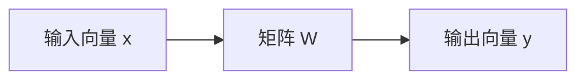

# 线性代数直觉

> 每个 AI 模型，本质上都是披着高级外衣的矩阵运算。

**课程类型：** 学习 / 实现  
**所属模块：** 线性代数  
**前置知识：** Phase 0：函数、坐标系、基础 Python  
**预计时间：** 约 60 分钟  
**使用语言：** Python / NumPy / PyTorch / Julia  


## 1. 提出问题：为什么 AI 算法工程师必须理解线性代数

线性代数不是为了背公式，而是为了回答一个核心问题：

> 如何用数字表示对象，并用计算规则改变这些对象？

在 AI 中，文本、图像、用户、商品、token、模型参数、注意力分数，最终都会变成向量、矩阵或张量。  
如果不理解线性代数，你看到的只是公式；如果理解线性代数，你能看见模型在空间中移动、压缩、投影和比较数据。


### 1.1 数学概念历史出现缘由

线性代数中的核心概念并不是为 AI 而发明的。

它们最初来自几类更早的问题：

| 数学概念 | 历史出现缘由 |
|---|---|
| 向量 | 为了描述力、速度、方向、位移等既有大小又有方向的量 |
| 矩阵 | 为了系统组织和求解多元线性方程组 |
| 点积 | 为了度量两个方向之间的关系，以及一个向量在另一个方向上的分量 |
| 线性无关 | 为了判断一组方向是否真的提供了新的自由度 |
| 基 | 为了用最少的一组方向表示整个空间 |
| 秩 | 为了判断一个线性系统或矩阵到底有多少有效维度 |
| 投影 | 为了把一个对象分解到某个方向或子空间上 |
| Gram-Schmidt | 为了把一组方向整理成互相垂直、长度为 1 的标准坐标系统 |

可以这样理解：

```txt
现实问题：如何描述方向和大小？
数学抽象：向量

现实问题：如何同时求解很多线性方程？
数学抽象：矩阵

现实问题：如何判断两个方向是否接近？
数学抽象：点积和余弦相似度

现实问题：如何判断一组方向是否冗余？
数学抽象：线性无关、基和秩

现实问题：如何把一个向量拆到某个方向上？
数学抽象：投影

现实问题：如何构造稳定、互相垂直的坐标系？
数学抽象：Gram-Schmidt 与正交归一基
```


### 1.2 原始问题是什么

线性代数最核心的原始问题可以概括为：

```txt
如何用一组数字表示空间中的对象？
如何用矩阵统一描述这些对象的变化？
如何判断不同方向、不同特征、不同表示之间的关系？
```

换成 AI 语言，就是：

```txt
如何把文本、图像、用户、商品变成向量？
如何用模型参数矩阵改变这些向量？
如何比较两个 embedding 是否相似？
如何判断特征是否冗余？
如何用低秩结构高效调整大模型？
```


### 1.3 AI 算法工程师为什么必须掌握它

打开任何机器学习论文，你很快就会看到：

- 向量
- 矩阵
- 点积
- 矩阵乘法
- 投影
- 秩
- 低秩分解
- 正交化
- embedding
- attention score

这些不是装饰符号，而是模型真正做计算的方式。

| 线性代数概念 | AI 中的现代问题 |
|---|---|
| 向量 | 如何表示一个词、一张图、一个用户或一个 token |
| 矩阵 | 如何理解神经网络权重和线性层 |
| 点积 | 如何计算 attention score 和 embedding 相似度 |
| 余弦相似度 | 如何做 RAG、推荐系统和向量检索 |
| 线性无关 | 如何判断特征是否提供新信息 |
| 秩 | 如何理解特征冗余、矩阵可逆性和 LoRA |
| 投影 | 如何理解线性回归、PCA 和注意力机制 |
| Gram-Schmidt / QR | 如何理解数值求解、正交基和稳定计算 |


### 1.4 本课要解决的核心问题

学完本课，你应该能够回答：

1. 向量为什么不仅是一组数字，也可以表示点和方向？
2. 矩阵为什么不只是数字表，而是空间变换？
3. 点积为什么能衡量相似度？
4. 线性无关、基和秩为什么关系到特征冗余和模型稳定性？
5. 投影为什么是线性回归、PCA 和注意力机制的基础？
6. Gram-Schmidt 为什么能构造稳定的正交坐标系？
7. 如何从零实现这些操作？
8. NumPy 和 PyTorch 中对应的生产级 API 是什么？


## 2. 概念定位：这节课学什么


### 2.1 所属模块

```txt
所属模块：线性代数
前置知识：函数、坐标系、基础 Python
后续连接：矩阵乘法、神经网络线性层、attention、embedding、PCA、SVD、LoRA
```

线性代数是 AI 数学路线中的第一块核心地基。  
它解决的是“对象如何表示”和“空间如何变换”的问题。


### 2.2 本课学习目标

完成本课后，你应该能够：

- 从零实现向量和矩阵操作，包括加法、点积、矩阵乘法
- 用几何直觉解释点积、投影和 Gram-Schmidt 过程
- 通过行化简判断线性无关、秩和基
- 说明线性代数如何出现在 embedding、attention score、PCA 和 LoRA 中
- 使用 NumPy / PyTorch 完成同样的计算
- 理解生产库背后到底在执行什么数学操作


### 2.3 本课在整体路线中的位置

上一阶段你已经掌握了基础数学表达和 Python。  
本课开始进入 AI 数学的第一条主线：**线性代数**。

```txt
函数与坐标系
    ↓
向量与矩阵
    ↓
点积、投影、秩、基
    ↓
矩阵分解、PCA、SVD、LoRA
    ↓
神经网络、attention、embedding、RAG
```


## 3. 理解概念：直觉、公式、几何解释、AI 连接


### 3.1 向量：点和方向

**一句话直觉：**

> 向量是一组数字，它既可以表示空间中的点，也可以表示方向和大小。

例如二维向量：

```txt
v = [3, 2]
```

它可以表示从原点 `(0, 0)` 指向 `(3, 2)` 的箭头。

| x | y | 含义 |
|---|---|---|
| 3 | 2 | 从原点指向平面上的点 `(3, 2)` |

向量长度为：

```text
||v|| = sqrt(3^2 + 2^2) = sqrt(13)
```

**AI 连接：**

| AI 对象 | 向量含义 |
|---|---|
| 一个词 | 词向量 embedding |
| 一张图 | 像素或视觉特征向量 |
| 一个用户 | 用户偏好向量 |
| 一个 token | Transformer 中的 hidden state |
| 一篇文档 | 文档 embedding |

在 AI 中，向量用来表示“对象的特征”。


### 3.2 矩阵：空间变换

**一句话直觉：**

> 矩阵是一种把向量从一个空间变换到另一个空间的工具。

矩阵可以：

- 旋转向量
- 缩放向量
- 拉伸空间
- 压缩空间
- 投影到某个方向或子空间



在神经网络中，一个线性层通常写成：

```text
y = Wx + b
```

其中：

| 符号 | 含义 |
|---|---|
| `x` | 输入向量 |
| `W` | 权重矩阵 |
| `b` | 偏置向量 |
| `y` | 输出向量 |

**AI 连接：**

| AI 对象 | 矩阵含义 |
|---|---|
| 神经网络权重 | 把输入表示变换为输出表示 |
| embedding table | 把 token id 映射为向量 |
| attention matrix | 描述 token 之间的关注关系 |
| LoRA 矩阵 | 用低秩结构更新大模型权重 |


### 3.3 点积：衡量方向相似度

**一句话直觉：**

> 点积衡量两个向量在方向上有多接近。

核心公式：

```text
a · b = a1*b1 + a2*b2 + ... + an*bn
```

解释：

| 结果 | 含义 |
|---|---|
| `a · b > 0` | 两个向量大致同方向，相似 |
| `a · b = 0` | 两个向量互相垂直，方向无关 |
| `a · b < 0` | 两个向量方向相反，不相似 |

如果再除以两个向量长度，就得到余弦相似度：

```text
cos(a, b) = (a · b) / (||a|| ||b||)
```

**AI 连接：**

| 场景 | 点积的作用 |
|---|---|
| attention | query 和 key 的相似度 |
| RAG | query embedding 和 document embedding 的相似度 |
| 推荐系统 | user embedding 和 item embedding 的匹配度 |
| 对比学习 | 判断正负样本距离 |

attention 中常见的公式：

```text
score = QK^T / sqrt(d)
```

本质上就是批量计算 query 和 key 的点积相似度。


### 3.4 线性无关：判断特征是否冗余

**一句话直觉：**

> 如果一组向量中，没有任何一个向量可以由其他向量组合出来，它们就是线性无关的。

例子：

```txt
v1 = [1, 0, 0]
v2 = [0, 1, 0]
v3 = [2, 1, 0]
```

这里：

```txt
v3 = 2*v1 + v2
```

所以 `v3` 并没有提供新的方向，这组三个向量线性相关。

**AI 连接：**

在数据集中，如果：

```txt
feature_3 = 2 * feature_1 + feature_2
```

那么 `feature_3` 没有提供新信息。  
这会导致：

- 特征冗余
- 多重共线性
- 回归权重不稳定
- 最小二乘解不唯一
- 模型对小扰动非常敏感


### 3.5 基和秩：空间有多少有效维度

**一句话直觉：**

> 基是描述一个空间所需的最少独立方向；秩是矩阵中真正有效的独立方向数量。

**基：**

三维空间的标准基是：

```txt
[1, 0, 0], [0, 1, 0], [0, 0, 1]
```

它们分别表示 x、y、z 三个独立方向。

**秩：**

矩阵的秩可以理解为：

```txt
rank = 线性无关列的数量 = 线性无关行的数量
```

| 情况 | 含义 | ML 中的意义 |
|---|---|---|
| 满秩 | 独立方向数量达到最大 | 解通常更稳定 |
| 秩亏 | 存在冗余方向 | 特征冗余，需要正则化 |
| 秩为 1 | 所有列都只是同一方向的缩放 | 数据基本落在一条线上 |
| 近似秩亏 | 存在很小的奇异值 | 数值不稳定，容易放大噪声 |

**AI 连接：**

| 概念 | AI 应用 |
|---|---|
| 秩 | 判断特征是否冗余 |
| 低秩 | LoRA、模型压缩 |
| 满秩 | 线性系统更稳定 |
| 秩亏 | 回归不稳定、解不唯一 |


### 3.6 投影：把一个向量拆到某个方向上

**一句话直觉：**

> 投影就是一个向量在另一个方向上的“影子”。

把向量 `a` 投影到向量 `b` 上：

```text
proj_b(a) = ((a · b) / (b · b)) * b
```

解释：

| 符号 | 含义 |
|---|---|
| `a` | 原始向量 |
| `b` | 目标方向 |
| `a · b` | `a` 和 `b` 的方向重合程度 |
| `b · b` | `b` 的长度平方 |
| `proj_b(a)` | `a` 在 `b` 方向上的分量 |

例子：

```txt
a = [3, 4]
b = [1, 0]

proj_b(a) = [3, 0]
```

这表示把 `[3, 4]` 投影到 x 轴后，只保留 x 方向分量，丢掉 y 方向分量。

**AI 连接：**

| 场景 | 投影的作用 |
|---|---|
| 线性回归 | 把观测值投影到特征列空间 |
| PCA | 把数据投影到最大方差方向 |
| attention | query 在 key 方向上的相似度 |
| 降维 | 丢掉不重要方向，只保留重要方向 |


### 3.7 Gram-Schmidt：构造正交归一基

**一句话直觉：**

> Gram-Schmidt 可以把一组独立向量变成互相垂直、长度为 1 的标准方向。

算法思想：

```txt
1. 取第一个向量，归一化
2. 取第二个向量，减去它在第一个方向上的投影，再归一化
3. 取第三个向量，减去它在前面所有方向上的投影，再归一化
4. 重复这个过程
```

公式形式：

```text
u1 = v1 / ||v1||

w2 = v2 - (v2 · u1)u1
u2 = w2 / ||w2||

w3 = v3 - (v3 · u1)u1 - (v3 · u2)u2
u3 = w3 / ||w3||
```

**AI 连接：**

Gram-Schmidt 是 QR 分解的基础。QR 分解常用于：

- 解线性系统
- 最小二乘回归
- 特征值计算
- 稳定数值计算
- 构造正交基
- whitening transform


### 3.8 本课核心概念总表

| 数学概念 | 一句话直觉 | AI 中的对应位置 |
|---|---|---|
| 向量 | 用数字表示点、方向或对象特征 | embedding、hidden state |
| 矩阵 | 空间变换工具 | neural network layer |
| 点积 | 衡量两个方向的相似度 | attention、RAG |
| 线性无关 | 判断方向是否提供新信息 | 特征选择、去冗余 |
| 基 | 表示空间的最小独立方向集合 | 表示空间、坐标系统 |
| 秩 | 有效独立方向数量 | LoRA、低秩压缩 |
| 投影 | 一个向量在某方向上的分量 | PCA、线性回归 |
| Gram-Schmidt | 构造正交归一基 | QR、数值稳定 |


## 4. 手写实现：从零实现线性代数核心操作

这一节先不用 NumPy、PyTorch 或 JAX。  
目标是让你知道生产库底层在做什么。


### 4.1 实现基础对象：Vector

```python
class Vector:
    def __init__(self, components):
        self.components = list(components)
        self.dim = len(self.components)

    def __add__(self, other):
        return Vector([a + b for a, b in zip(self.components, other.components)])

    def __sub__(self, other):
        return Vector([a - b for a, b in zip(self.components, other.components)])

    def dot(self, other):
        return sum(a * b for a, b in zip(self.components, other.components))

    def magnitude(self):
        return sum(x ** 2 for x in self.components) ** 0.5

    def normalize(self):
        mag = self.magnitude()
        return Vector([x / mag for x in self.components])

    def cosine_similarity(self, other):
        return self.dot(other) / (self.magnitude() * other.magnitude())

    def __repr__(self):
        return f"Vector({self.components})"
```

验证：

```python
a = Vector([1, 2, 3])
b = Vector([4, 5, 6])

print(f"a + b = {a + b}")
print(f"a · b = {a.dot(b)}")
print(f"|a| = {a.magnitude():.4f}")
print(f"cosine similarity = {a.cosine_similarity(b):.4f}")
```


### 4.2 实现基础对象：Matrix

```python
class Matrix:
    def __init__(self, rows):
        self.rows = [list(row) for row in rows]
        self.shape = (len(self.rows), len(self.rows[0]))

    def __matmul__(self, other):
        if isinstance(other, Vector):
            return Vector([
                sum(self.rows[i][j] * other.components[j] for j in range(self.shape[1]))
                for i in range(self.shape[0])
            ])

        rows = []
        for i in range(self.shape[0]):
            row = []
            for j in range(other.shape[1]):
                row.append(sum(
                    self.rows[i][k] * other.rows[k][j]
                    for k in range(self.shape[1])
                ))
            rows.append(row)

        return Matrix(rows)

    def transpose(self):
        return Matrix([
            [self.rows[j][i] for j in range(self.shape[0])]
            for i in range(self.shape[1])
        ])

    def __repr__(self):
        return f"Matrix({self.rows})"
```

验证 90 度旋转：

```python
rotation_90 = Matrix([[0, -1], [1, 0]])
point = Vector([3, 1])

rotated = rotation_90 @ point

print(f"Original: {point}")
print(f"Rotated 90°: {rotated}")
```


### 4.3 用矩阵乘法模拟神经网络层

```python
import random

random.seed(42)

weights = Matrix([
    [random.gauss(0, 0.1) for _ in range(3)]
    for _ in range(2)
])

input_vector = Vector([1.0, 0.5, -0.3])
output = weights @ input_vector

print(f"Input (3D): {input_vector}")
print(f"Output (2D): {output}")
print("这就是神经网络线性层正在做的事情：矩阵乘法。")
```

解释：

```txt
输入是一个 3 维向量。
权重矩阵把它变成一个 2 维向量。
这就是 y = Wx 的最小版本。
```


### 4.4 实现线性无关、投影和 Gram-Schmidt

```python
def is_linearly_independent(vectors):
    n = len(vectors)
    dim = len(vectors[0].components)

    mat = Matrix([v.components[:] for v in vectors])
    rows = [row[:] for row in mat.rows]

    rank = 0

    for col in range(dim):
        pivot = None

        for row in range(rank, len(rows)):
            if abs(rows[row][col]) > 1e-10:
                pivot = row
                break

        if pivot is None:
            continue

        rows[rank], rows[pivot] = rows[pivot], rows[rank]

        scale = rows[rank][col]
        rows[rank] = [x / scale for x in rows[rank]]

        for row in range(len(rows)):
            if row != rank and abs(rows[row][col]) > 1e-10:
                factor = rows[row][col]
                rows[row] = [
                    rows[row][j] - factor * rows[rank][j]
                    for j in range(dim)
                ]

        rank += 1

    return rank == n


def project(a, b):
    scalar = a.dot(b) / b.dot(b)
    return Vector([scalar * x for x in b.components])


def gram_schmidt(vectors):
    orthonormal = []

    for v in vectors:
        w = v

        for u in orthonormal:
            proj = project(w, u)
            w = w - proj

        if w.magnitude() < 1e-10:
            continue

        orthonormal.append(w.normalize())

    return orthonormal
```

验证：

```python
v1 = Vector([1, 0, 0])
v2 = Vector([1, 1, 0])
v3 = Vector([1, 1, 1])

basis = gram_schmidt([v1, v2, v3])

for i, u in enumerate(basis):
    print(f"u{i+1} = {u}")
    print(f"  |u{i+1}| = {u.magnitude():.6f}")

print(f"u1 · u2 = {basis[0].dot(basis[1]):.6f}")
print(f"u1 · u3 = {basis[0].dot(basis[2]):.6f}")
print(f"u2 · u3 = {basis[1].dot(basis[2]):.6f}")
```

如果输出向量两两点积接近 0，且每个向量长度接近 1，说明它们构成了正交归一基。


## 5. 生产使用：用 NumPy / PyTorch 完成同样任务


### 5.1 NumPy 版本：向量和矩阵运算

```python
import numpy as np

a = np.array([1, 2, 3], dtype=float)
b = np.array([4, 5, 6], dtype=float)

print(f"a + b = {a + b}")
print(f"a · b = {np.dot(a, b)}")
print(f"|a| = {np.linalg.norm(a):.4f}")

cosine = np.dot(a, b) / (np.linalg.norm(a) * np.linalg.norm(b))
print(f"cosine = {cosine:.4f}")

W = np.random.randn(2, 3) * 0.1
x = np.array([1.0, 0.5, -0.3])

print(f"Wx = {W @ x}")
```


### 5.2 NumPy 版本：秩、投影和 QR

```python
import numpy as np

A = np.array([[1, 2], [2, 4]])
print(f"Rank: {np.linalg.matrix_rank(A)}")

a = np.array([3, 4])
b = np.array([1, 0])

proj = (np.dot(a, b) / np.dot(b, b)) * b
print(f"Projection of {a} onto {b}: {proj}")

Q, R = np.linalg.qr(np.random.randn(3, 3))

print(f"Q is orthogonal: {np.allclose(Q @ Q.T, np.eye(3))}")
print(f"R is upper triangular: {np.allclose(R, np.triu(R))}")
```


### 5.3 PyTorch 版本：张量和自动微分

```python
import torch

x = torch.randn(3, requires_grad=True)
y = torch.tensor([1.0, 0.0, 0.0])

similarity = torch.dot(x, y)
similarity.backward()

print(f"x = {x.data}")
print(f"y = {y.data}")
print(f"dot product = {similarity.item():.4f}")
print(f"d(dot)/dx = {x.grad}")
```

解释：

```txt
dot(x, y) 对 x 的梯度就是 y。
PyTorch 自动记录计算图，并通过 backward() 算出梯度。
```

这说明神经网络中的很多操作，本质上就是矩阵乘法、点积、投影这类线性代数操作，再加上自动微分。


### 5.4 Julia 版本：可选补充

```julia
a = [1.0, 2.0, 3.0]
b = [4.0, 5.0, 6.0]

println("a + b = ", a + b)
println("a · b = ", a ⋅ b)
println("|a| = ", √(a ⋅ a))
println("cosine = ", (a ⋅ b) / (√(a ⋅ a) * √(b ⋅ b)))

W = [0.1 -0.2 0.3; 0.4 0.5 -0.1]
x = [1.0, 0.5, -0.3]

println("Wx = ", W * x)
println("这就是一个神经网络线性层。")
```


### 5.5 手写实现 vs 生产库

| 对比项 | 手写实现 | NumPy / PyTorch |
|---|---|---|
| 目的 | 理解原理 | 工程实践 |
| 性能 | 慢 | 快，支持向量化和 GPU |
| 自动求导 | 需要自己实现 | PyTorch 自动完成 |
| 可读性 | 适合学习 | 适合项目 |
| 使用场景 | 教学、验证底层机制 | 训练、推理、部署 |


## 6. 交付沉淀：产出物、连接关系、练习、术语表


### 6.1 本课产出

```txt
code/from_scratch.py
code/use_numpy.py
code/use_pytorch.py
code/use_julia.jl
outputs/prompt-linear-algebra-tutor.md
outputs/exercises-solutions.md
```

| 文件 | 作用 |
|---|---|
| `code/from_scratch.py` | 从零实现向量、矩阵、投影、Gram-Schmidt |
| `code/use_numpy.py` | NumPy 版本线性代数操作 |
| `code/use_pytorch.py` | PyTorch 版本点积、张量和自动微分 |
| `code/use_julia.jl` | Julia 版本线性代数基础操作 |
| `outputs/prompt-linear-algebra-tutor.md` | 用于 AI 助手教学线性代数直觉的 prompt |
| `outputs/exercises-solutions.md` | 练习题与参考答案 |


### 6.2 知识连接关系

| 本课知识点 | 后续连接 |
|---|---|
| 向量 | embedding、hidden state、token representation |
| 矩阵 | neural network layer、attention projection |
| 点积 | attention score、cosine similarity、RAG |
| 线性无关 | 特征选择、多重共线性 |
| 秩 | LoRA、低秩分解、模型压缩 |
| 投影 | linear regression、PCA |
| Gram-Schmidt / QR | 数值求解、特征值计算、正交化 |


### 6.3 AI 应用连接

| 数学知识点 | AI 应用 |
|---|---|
| 点积 | Transformer attention score、RAG 相似度搜索 |
| 矩阵乘法 | 每一个神经网络线性层 |
| 线性无关 | 特征选择，避免多重共线性 |
| 秩 | 判断线性系统是否可解，理解 LoRA |
| 投影 | 线性回归、PCA |
| Gram-Schmidt / QR | 数值线性代数、稳定求解 |
| 正交归一基 | whitening transform、稳定数值计算 |

特别说明：LoRA 利用低秩矩阵更新大模型参数。  
例如原本一个 `4096 x 4096` 的权重矩阵有约 1600 万个参数，而 LoRA 可以用两个小矩阵近似更新：

```txt
4096 x 16
16 x 4096
```

这相当于假设权重更新主要发生在一个低维子空间中。  
这就是线性代数中的“低秩结构”在大模型微调中的真实应用。


### 6.4 练习

1. 实现 `Vector.angle_between(other)`，返回两个向量之间的夹角，单位为度。
2. 构造一个二维缩放矩阵，让 x 坐标放大 2 倍，y 坐标放大 3 倍，并作用到向量 `[1, 1]` 上。
3. 随机生成 5 个 50 维“词向量”，用余弦相似度找出最相似的两个。
4. 验证 Gram-Schmidt 的输出是否真的正交归一：两两点积是否接近 0，每个向量长度是否接近 1。
5. 构造一个 `3 x 3` 的秩为 2 的矩阵，并解释它的列向量张成了什么几何对象。
6. 把向量 `[1, 2, 3]` 投影到 `[1, 1, 1]` 上，并解释投影结果的几何含义。


### 6.5 关键术语

| 术语 | 常见说法 | 真正含义 |
|---|---|---|
| 向量 | 一个箭头 | 用数字表示空间中的点、方向或对象特征 |
| 矩阵 | 一张数字表 | 把向量从一个空间映射到另一个空间的变换 |
| 点积 | 对应相乘再相加 | 衡量两个向量方向是否相似 |
| embedding | AI 魔法向量 | 对词、图像、用户等对象的向量化表示 |
| 线性无关 | 方向不重复 | 没有任何一个向量能由其他向量组合出来 |
| 秩 | 有多少维 | 矩阵中线性无关行或列的数量 |
| 投影 | 影子 | 一个向量在另一个方向上的分量 |
| 基 | 坐标轴 | 表示整个空间所需的最少独立方向集合 |
| 正交归一 | 垂直且长度为 1 | 向量两两垂直，并且每个向量模长为 1 |
| Gram-Schmidt | 正交化方法 | 把独立向量转换成正交归一基的过程 |


### 6.6 自检问题

学完本课后，你应该能回答：

- 线性代数中的向量和矩阵最初为什么会出现？
- 为什么向量可以表示 AI 中的文本、图像和用户？
- 为什么矩阵不只是数字表，而是空间变换？
- 点积为什么可以用来衡量 embedding 相似度？
- 为什么线性相关的特征会导致模型不稳定？
- 秩和 LoRA 的低秩更新有什么关系？
- 投影为什么是线性回归和 PCA 的基础？
- Gram-Schmidt 如何构造正交归一基？
- 如何从零实现向量、矩阵、投影和 Gram-Schmidt？
- NumPy / PyTorch 中对应的 API 是什么？


## 附录：本课最小代码文件建议

如果要拆成代码文件，可以这样组织：

```txt
code/
├── from_scratch.py
├── use_numpy.py
├── use_pytorch.py
└── use_julia.jl
```

### `from_scratch.py`

包含：

```txt
Vector
Matrix
is_linearly_independent
project
gram_schmidt
```

### `use_numpy.py`

包含：

```txt
np.dot
np.linalg.norm
np.linalg.matrix_rank
np.linalg.qr
projection with numpy
```

### `use_pytorch.py`

包含：

```txt
torch.dot
requires_grad=True
similarity.backward()
x.grad
```

### `use_julia.jl`

包含：

```txt
vector addition
dot product
matrix-vector multiplication
```
